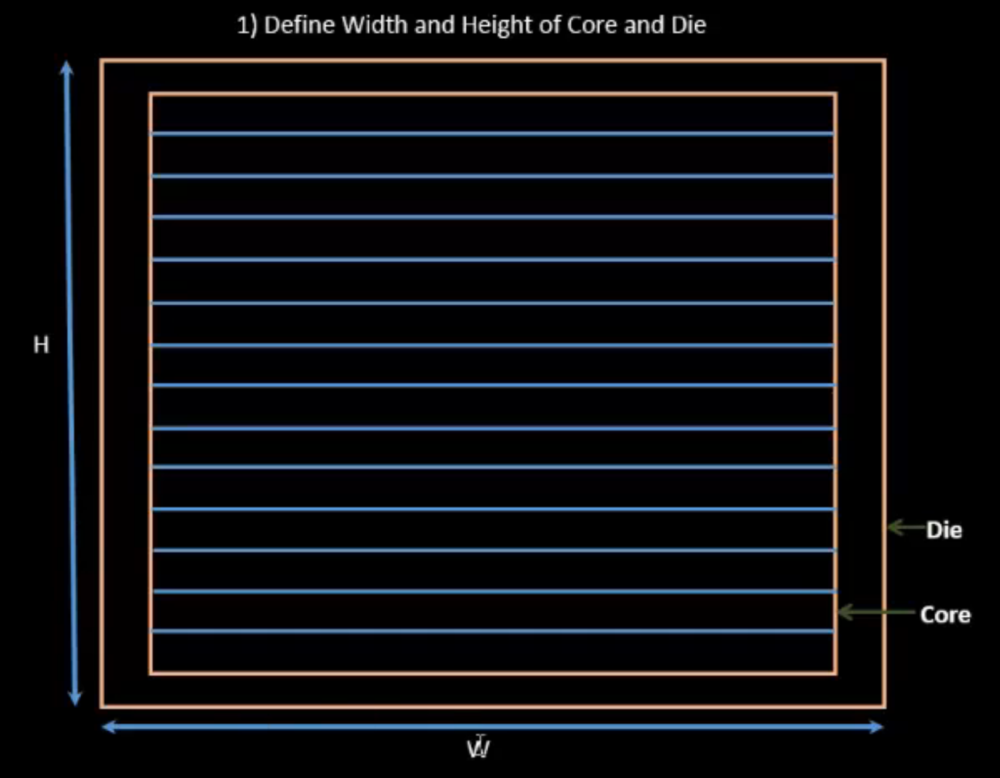
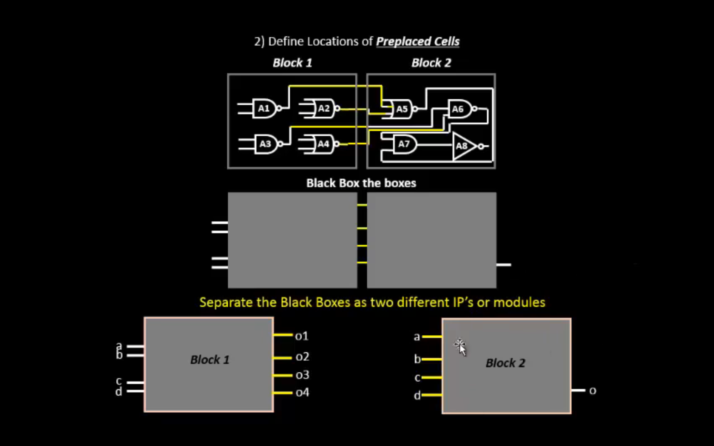
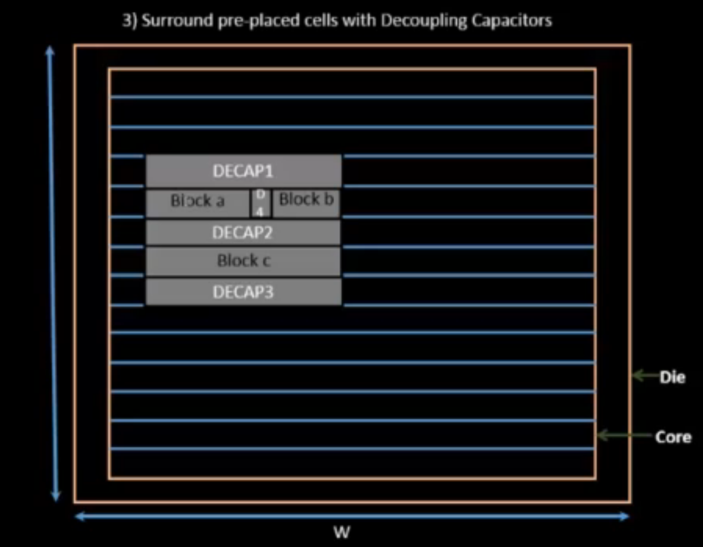
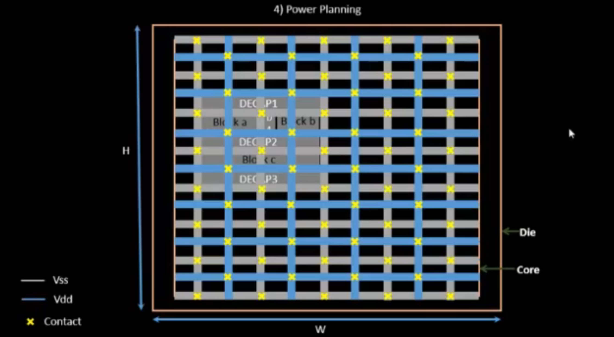
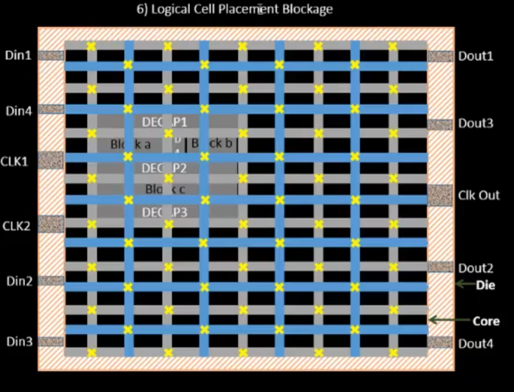
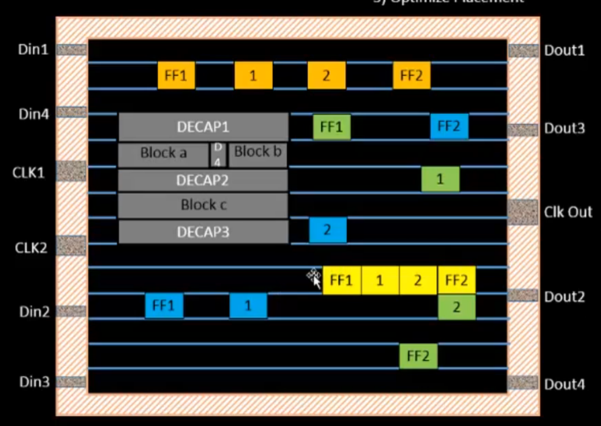
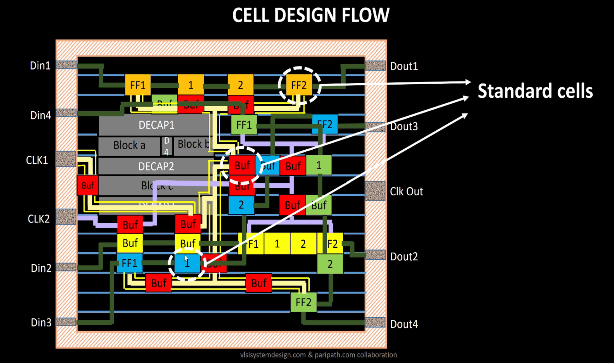
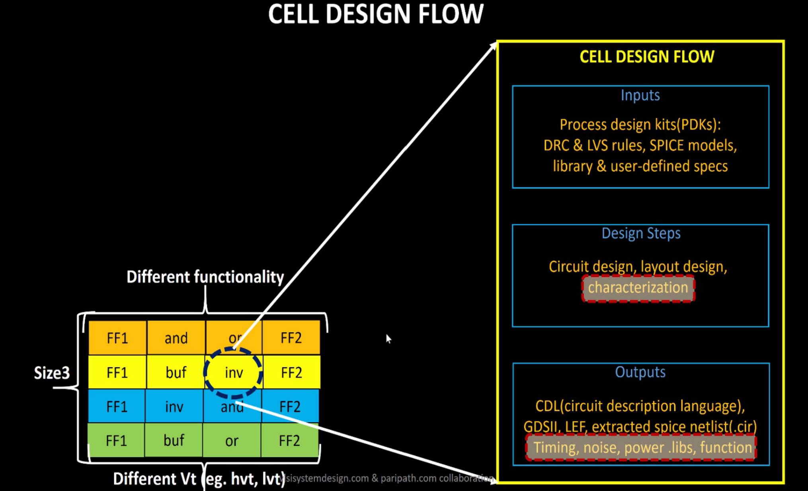
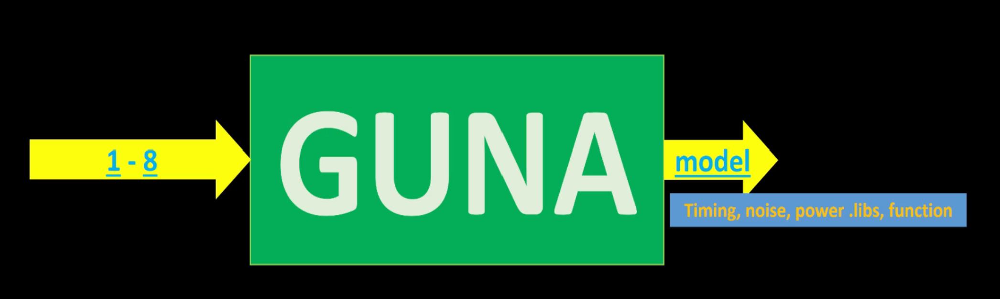
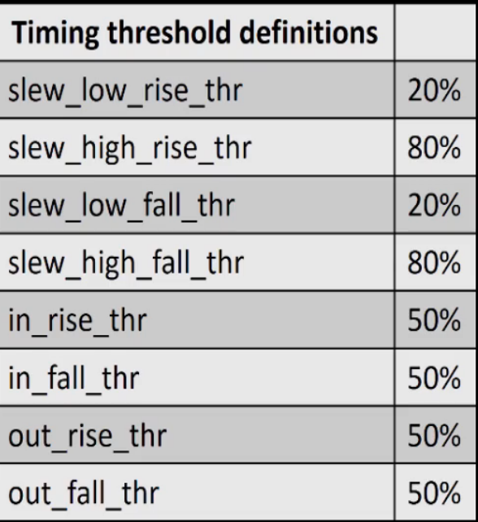

# Day 2 - Good Floorplan vs Bad Floorplan and Introduction to Library Cells

## SKY130_D2_SK1 - Chip Floor Planning Considerations

Floorplanning is the first step of physical design after synthesis. It defines how the chip area is organized — where blocks go, how power is distributed, and where I/O pins are placed. Good floorplanning directly impacts timing, power, and routability.

There are **6 key steps** in chip floorplanning:

---

### L1 - Utilization Factor and Aspect Ratio

The first decision in floorplanning is defining the **width and height** of the Core and Die.

<div align="center">

</div>
<p align="center">
<b>Figure 1:</b> Defining Width (W) and Height (H) of Core and Die
</p>

Two important metrics:

```
Utilization Factor = Area occupied by Netlist / Total Core Area

Aspect Ratio       = Height / Width of Core
```

| Metric | Ideal Value | Meaning |
|--------|-------------|---------|
| Utilization Factor | 0.5 – 0.6 | 50–60% of core is used; rest is for routing and buffers |
| Aspect Ratio = 1 | Square core | Any other value means rectangular core |

> A utilization factor of 1 means 100% filled — no room for routing. Always keep it between 0.5 and 0.6.

---

### L2 - Concept of Pre-Placed Cells

<div align="center">

</div>
<p align="center">
<b>Figure 2:</b> Defining Locations of Pre-Placed Cells — Black-boxed IPs placed before standard cell placement
</p>

**Pre-placed cells** are large functional blocks (memory, clock gating cells, comparators, mux) that are:
- Placed **manually** by the designer before automated placement
- Treated as **black boxes** — their internal implementation is hidden from the tool
- **Fixed** in location — the placer does not move them

Examples: Block a, Block b, Block c (memory macros, analog IPs, complex logic blocks)

> The placer respects pre-placed cell locations and routes around them.

---

### L3 - De-Coupling Capacitors

<div align="center">

</div>
<p align="center">
<b>Figure 3:</b> Surrounding Pre-Placed Cells with Decoupling Capacitors (DECAP1, DECAP2, DECAP3)
</p>

**Problem:** When a logic circuit switches, it demands a sudden burst of current from VDD. Due to wire resistance and inductance, the actual voltage at the cell drops below the required level — this can cause incorrect logic switching.

**Solution:** Place **Decoupling Capacitors (DECAPs)** next to pre-placed cells.

- DECAPs are large capacitors charged to VDD
- During switching, the cell draws current from the nearby DECAP instead of from the far-away power supply
- This keeps the local voltage stable within the **noise margin** range

> DECAPs solve the local power supply problem. But what about cells that are far from pre-placed blocks? → Power Planning solves that.

---

### L4 - Power Planning

<div align="center">

</div>
<p align="center">
<b>Figure 4:</b> Power Planning — VDD/VSS mesh grid with contacts across the core
</p>

**Problem:** A single VDD/VSS rail causes two issues when many cells switch simultaneously:
- **Ground bounce** — multiple cells discharging to a single ground → ground voltage rises temporarily
- **Voltage droop** — multiple cells drawing from a single supply → VDD drops temporarily

**Solution:** Use a **Power Mesh** — multiple VDD and VSS lines running horizontally and vertically across the core.

- Every cell can tap into the nearest VDD/VSS intersection
- Reduces IR drop significantly
- Legend: **Grey = VSS**, **Blue = VDD**, **Yellow × = Contact**

---

### L5 - Pin Placement and Logical Cell Placement Blockage

<div align="center">

</div>
<p align="center">
<b>Figure 5:</b> Pin Placement on Die Boundary and Logical Cell Placement Blockage in I/O ring area
</p>

**Pin Placement:**
- Input/output pins are placed on the **boundary between core and die**
- Pin placement is done based on which block they connect to — pins are placed close to their connected blocks to minimize wire length
- Clock pins (CLK1, CLK2) are wider than data pins — they drive the entire chip and need lower resistance

**Logical Cell Placement Blockage:**
- The area between the core boundary and die boundary (the I/O ring region) is marked as a **placement blockage**
- This prevents the automated placer from placing standard cells in the I/O ring area
- Ensures pins and I/O pads have clean routing space

---

### L6 - Steps to Run Floorplan Using OpenLANE

```bash
# After synthesis, run floorplan
run_floorplan
```

Key floorplan configuration variables (set in `config.tcl` or `floorplan.tcl`):

| Variable | Default | Description |
|----------|---------|-------------|
| `FP_CORE_UTIL` | 50 | Core utilization (%) |
| `FP_ASPECT_RATIO` | 1 | Core aspect ratio |
| `FP_IO_VMETAL` | 3 | Vertical I/O pin metal layer |
| `FP_IO_HMETAL` | 4 | Horizontal I/O pin metal layer |
| `FP_PDN_VPITCH` | 153.6 | Vertical power stripe pitch (µm) |
| `FP_PDN_HPITCH` | 153.18 | Horizontal power stripe pitch (µm) |

> Priority order for config: `sky130A_sky130_fd_sc_hd_config.tcl` > `config.tcl` > OpenLANE defaults

---

### L7 - Review Floorplan Files and Steps to View Floorplan

After `run_floorplan`, output files are created at:

```
designs/picorv32a/runs/<tag>/results/floorplan/
└── picorv32a.floorplan.def        ← DEF file with floorplan info

designs/picorv32a/runs/<tag>/logs/floorplan/
└── ioPlacer.log                   ← I/O placement log

designs/picorv32a/runs/<tag>/reports/floorplan/
└── core_area.rpt                  ← Core area report
```

**Reading the DEF file to find die area:**
```
# Inside .def file
DIEAREA ( 0 0 ) ( 660685 671405 ) ;
# Units: microns × 1000 (UNITS DISTANCE MICRONS 1000)
# Die Width  = 660685 / 1000 = 660.685 µm
# Die Height = 671405 / 1000 = 671.405 µm
```

---

### L8 - Review Floorplan Layout in Magic

```bash
# Open floorplan DEF in Magic
magic -T ~/Desktop/work/tools/openlane_working_dir/pdks/sky130A/libs.tech/magic/sky130A.tech \
  lef read ../../tmp/merged.lef \
  def read picorv32a.floorplan.def &
```

**Useful Magic commands:**
```
Press S         → Select an object
Press V         → Fit the view to screen
Press Z         → Zoom in
what            → Show selected layer/cell info (in Tcl console)
```

> In the floorplan view: I/O pins appear on all four edges, DECAPs are visible around pre-placed blocks, and the power grid stripes are visible on upper metal layers.

---

## SKY130_D2_SK2 - Library Binding and Placement

### L1 - Netlist Binding and Initial Place Design

**Library** contains all standard cells with:
- Physical dimensions (width × height)
- Timing information (delay, setup/hold time)
- Multiple flavours: same function, different sizes and threshold voltages

**Netlist binding** = assigning each gate in the netlist to a real physical cell from the library.

**Initial placement** = placing all bound cells inside the core, without overlap, respecting pre-placed cell locations.

---

### L2 - Optimize Placement Using Estimated Wire-Length and Capacitance

<div align="center">

</div>
<p align="center">
<b>Figure 6:</b> Optimized Placement — cells placed close to their connected pins; repeaters inserted for long paths
</p>

The placer estimates wire length between connected cells. If the estimated wire capacitance is too high:
- **Repeaters (buffers)** are inserted to re-drive the signal
- This maintains **signal integrity** at the cost of extra area

> This is the **optimization** stage — the placer tries to minimize wire length while meeting timing.

---

### L3 - Final Placement Optimization

After initial placement and repeater insertion:
- **Timing-driven placement** is performed
- Cells in critical paths are placed closer together
- **Setup timing** is checked using estimated parasitics (before actual routing)

---

### L4 - Need for Libraries and Characterization

Every stage of the ASIC flow needs the **library**:

| Stage | What it needs from library |
|-------|---------------------------|
| Synthesis | Gate-level models, timing arcs |
| Floorplan | Cell dimensions (height, width) |
| Placement | Physical LEF, timing |
| CTS | Drive strength, capacitance |
| Routing | Metal layers, pin locations |
| STA | Timing arcs, delays |

**Cell characterization** is the process of generating these library models by running SPICE simulations across process, voltage, and temperature (PVT) corners.

---

### L5 - Congestion Aware Placement Using RePlAce

```bash
# Run placement in OpenLANE
run_placement
```

OpenLANE uses **RePlAce** for global placement:
- Minimizes **Half-Perimeter Wire Length (HPWL)**
- Uses **congestion-aware** algorithms to avoid routing hotspots
- Followed by **detailed placement** (OpenDP) to legalize cell positions to standard cell rows

```bash
# View placement result in Magic
magic -T ~/Desktop/work/tools/openlane_working_dir/pdks/sky130A/libs.tech/magic/sky130A.tech \
  lef read ../../tmp/merged.lef \
  def read picorv32a.placement.def &
```

> After placement, all standard cells are snapped to rows, no overlaps exist, and timing is improved compared to initial placement.

---

## SKY130_D2_SK3 - Cell Design and Characterization Flows

### L1 - Inputs for Cell Design Flow

<div align="center">

</div>
<p align="center">
<b>Figure 7:</b> Complete Cell Design Flow showing Standard Cells (FF1, FF2, Buf, logic gates) placed in the core
</p>

<div align="center">

</div>
<p align="center">
<b>Figure 8:</b> Cell Design Flow — Inputs → Design Steps → Outputs
</p>

**Inputs to Cell Design Flow:**

| Input | Description |
|-------|-------------|
| **PDK** | DRC & LVS rules, SPICE models |
| **Library specs** | Cell height, supply voltage, pin locations, metal layers |
| **User-defined specs** | Drive strength, transition time targets |

---

### L2 - Circuit Design Step

- Implement the cell function using PMOS/NMOS transistors
- Size transistors to meet drive strength and timing specs
- Output: **Circuit Description Language (CDL)** netlist

---

### L3 - Layout Design Step

- Derive PMOS and NMOS network graphs from the circuit
- Implement **Euler's path** to determine optimal transistor ordering
- Draw the layout in Magic following DRC rules
- Output: **GDSII** and **LEF** files

---

### L4 - Typical Characterization Flow

<div align="center">

</div>
<p align="center">
<b>Figure 9:</b> GUNA — Characterization software that takes inputs 1–8 and outputs timing/noise/power models
</p>

**Characterization is done using GUNA software:**

Steps fed into GUNA (inputs 1–8):
1. Read the SPICE model files
2. Read the extracted SPICE netlist
3. Define cell behaviour (buffer, inverter, FF, etc.)
4. Read subcircuits
5. Attach power sources
6. Apply stimulus (input waveform)
7. Set output load capacitance
8. Set simulation commands (`.tran`, `.dc`)

**Outputs from GUNA:**
- **Timing models** → `.lib` files (timing, noise, power)
- **CDL**, **GDSII**, **LEF**, **extracted SPICE netlist (.cir)**

---

## SKY130_D2_SK4 - General Timing Characterization Parameters

### L1 - Timing Threshold Definitions

<div align="center">

</div>
<p align="center">
<b>Figure 10:</b> Timing Threshold Definitions used in cell characterization
</p>

| Parameter | Value | Used For |
|-----------|-------|----------|
| `slew_low_rise_thr` | 20% | Start of rising output slew measurement |
| `slew_high_rise_thr` | 80% | End of rising output slew measurement |
| `slew_low_fall_thr` | 20% | Start of falling output slew measurement |
| `slew_high_fall_thr` | 80% | End of falling output slew measurement |
| `in_rise_thr` | 50% | Input reference point for rising propagation delay |
| `in_fall_thr` | 50% | Input reference point for falling propagation delay |
| `out_rise_thr` | 50% | Output reference point for rising propagation delay |
| `out_fall_thr` | 50% | Output reference point for falling propagation delay |

---

### L2 - Propagation Delay and Transition Time

**Propagation Delay:**
```
Rise Delay = time(out crosses out_rise_thr) - time(in crosses in_fall_thr)
Fall Delay = time(out crosses out_fall_thr) - time(in crosses in_rise_thr)
```

> ⚠️ Choosing a wrong threshold can give **negative delay** — always ensure output threshold crossing happens after input threshold crossing.

**Transition Time (Slew):**
```
Rise Transition = time(slew_high_rise_thr) - time(slew_low_rise_thr)
Fall Transition = time(slew_high_fall_thr) - time(slew_low_fall_thr)
```

| Parameter | Formula |
|-----------|---------|
| Rise Transition | t(80% VDD) − t(20% VDD) on rising output |
| Fall Transition | t(20% VDD) − t(80% VDD) on falling output |
| Cell Rise Delay | t(50% out↑) − t(50% in↓) |
| Cell Fall Delay | t(50% out↓) − t(50% in↑) |

---

## Summary

By the end of Day 2 we understood:
- The 6 steps of chip floorplanning: die/core sizing → pre-placed cells → DECAPs → power planning → pin placement → blockage
- How utilization factor and aspect ratio define the core area
- Why DECAPs and a power mesh are essential for stable power delivery
- How placement works: netlist binding → initial place → optimization → congestion-aware global placement
- The complete cell design flow: Inputs (PDK) → Circuit design → Layout → Characterization (GUNA) → Outputs (.lib, GDSII, LEF)
- Timing threshold definitions used in cell characterization and how propagation delay and slew are measured

---

> Previous: [Day 1 - Inception of Open-Source EDA, OpenLANE and Sky130 PDK](./Day1-Inception-of-OpenSource-EDA-OpenLANE-Sky130PDK.md)

> Next: [Day 3 - Design Library Cell using Magic Layout and ngspice Characterization](./Day3-Magic-Layout-ngspice-Characterization.md)
