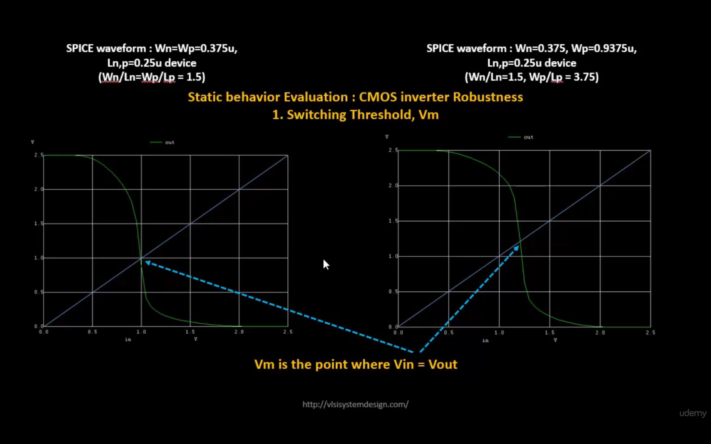
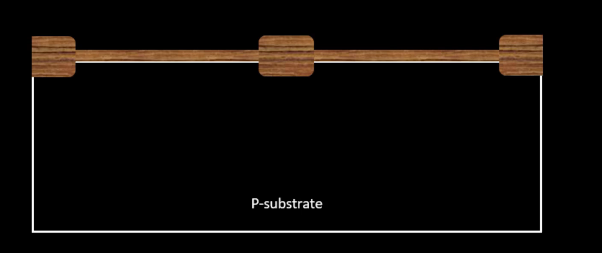
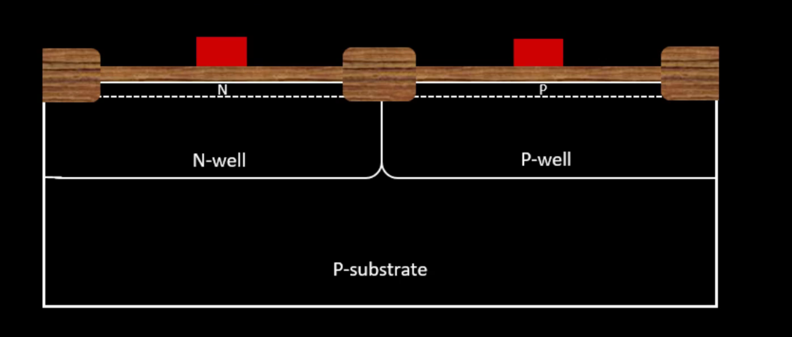
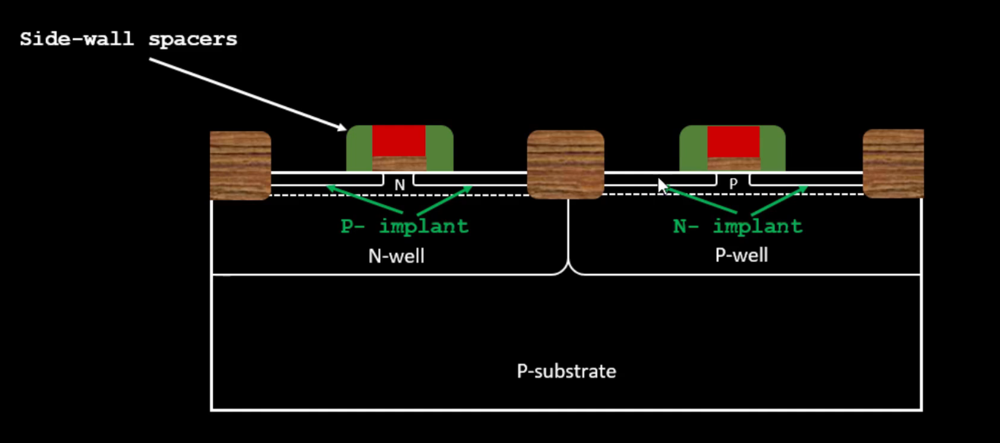
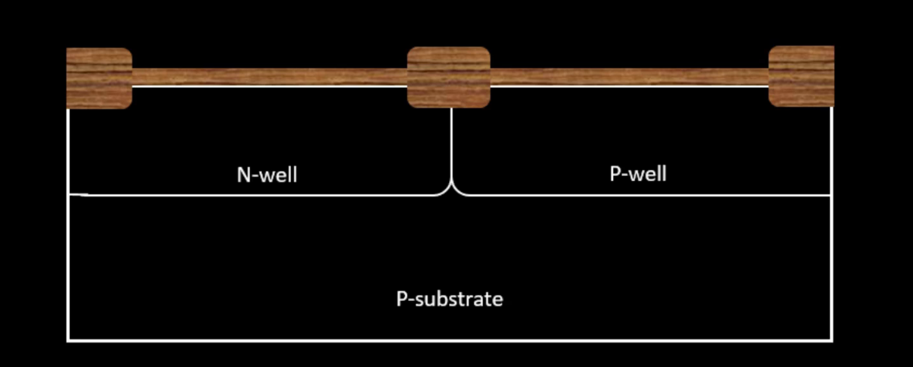
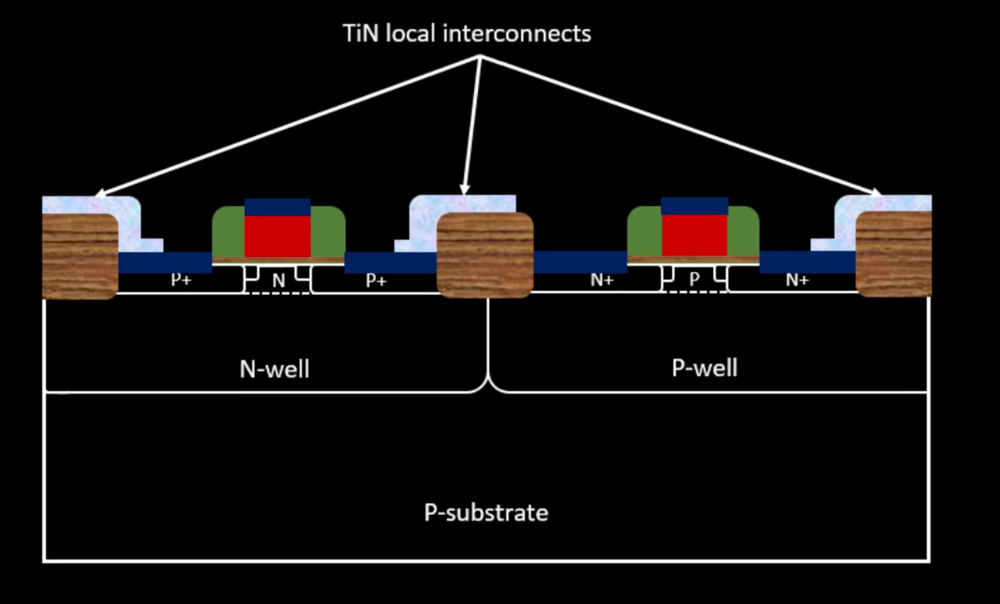
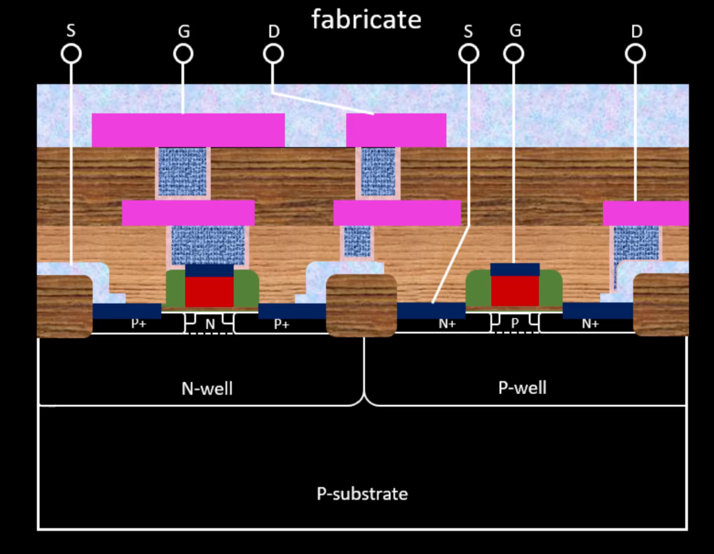

# Day 3 - Design Library Cell using Magic Layout and ngspice Characterization

## SKY130_D3_SK1 - Labs for CMOS Inverter ngspice Simulations

### L0 - IO Placer Revision

OpenLANE allows changing configuration variables **on the fly** without re-running the entire flow.

```bash
# Example: Change I/O pin placement mode mid-flow
set ::env(FP_IO_MODE) 2
run_floorplan
```

| `FP_IO_MODE` value | Pin placement style |
|--------------------|-------------------|
| 1 (default) | Pins evenly distributed around die |
| 2 | Pins stacked/concentrated on one side |

> This is useful when you want to experiment with different floorplan settings without starting a fresh run.

---

### L1 - SPICE Deck Creation for CMOS Inverter

A **SPICE deck** defines the netlist, component values, power supplies, stimulus, and simulation commands.

```spice
*** CMOS Inverter SPICE Deck ***

* Connectivity: [drain] [gate] [source] [substrate] [model] W= L=
M1 out in vdd vdd pmos W=0.375u L=0.25u   * PMOS
M2 out in 0   0   nmos W=0.375u L=0.25u   * NMOS

* Load capacitance
Cload out 0 10f

* Power supply
Vdd vdd 0 2.5V
Vss vss 0 0V

* Input stimulus
Vin in 0 2.5V

* Simulation command
.op
.dc Vin 0 2.5 0.05

*** Include model files ***
.LIB "tsmc_025um_model.mod" CMOS_MODELS
.end
```

Key sizing rules:
- PMOS width is typically **2–3× wider** than NMOS to match drive strength (µn ≈ 2×µp)
- `Wn/Ln = Wp/Lp = 1.5` → symmetric inverter (Vm ≈ VDD/2)

---

### L2 - SPICE Simulation Lab for CMOS Inverter

```bash
# Run ngspice
ngspice sky130_inv.spice

# Inside ngspice prompt
plot out vs time in       # Transient waveform
plot out vs in            # DC transfer curve (VTC)
```

**Voltage Transfer Characteristic (VTC)** shows:
- Logic HIGH region: output stays near VDD
- Logic LOW region: output stays near 0V
- Transition region: where output switches (gain > 1)

---

### L3 - Switching Threshold Vm

<div align="center">

</div>
<p align="center">
<b>Figure 1:</b> CMOS Inverter Switching Threshold Vm — point where Vin = Vout on the VTC curve
</p>

**Switching Threshold (Vm)** is the point on the VTC where **Vin = Vout**.

- At Vm, both PMOS and NMOS are simultaneously ON → short-circuit current flows
- Vm determines the **noise margin** of the inverter
- Ideal: Vm = VDD/2 (symmetric inverter)

| W ratio | Vm |
|---------|----|
| Wn=Wp=0.375u (Wn/Ln = Wp/Lp = 1.5) | ~1.0V (shifted left) |
| Wp=0.9375u (Wp/Lp = 3.75) | ~1.2V (closer to VDD/2) |

> Increasing PMOS width shifts Vm towards VDD/2 — making the inverter more symmetric.

---

### L4 - Static and Dynamic Simulation of CMOS Inverter

**Static (DC) simulation** → VTC curve, Vm, noise margins

**Dynamic (Transient) simulation** → Rise/fall delay, transition times

```spice
* Transient stimulus: PULSE
Vin in 0 PULSE(0 2.5 0 10p 10p 1n 2n)

.tran 10p 4n
.control
run
plot out vs time in
.endc
```

From transient simulation, measure:
- **Rise time** = t(80% VDD) − t(20% VDD) on rising output
- **Fall time** = t(80% VDD) − t(20% VDD) on falling output
- **Propagation delay** = t(50% output) − t(50% input)

---

### L5 - Lab Steps to Git Clone vsdstdcelldesign

```bash
# Navigate to OpenLANE directory
cd ~/Desktop/work/tools/openlane_working_dir/openlane

# Clone the standard cell design repository
git clone https://github.com/nickson-jose/vsdstdcelldesign.git

# Navigate into it
cd vsdstdcelldesign

# Copy Sky130 tech file into this directory
cp ~/Desktop/work/tools/openlane_working_dir/pdks/sky130A/libs.tech/magic/sky130A.tech .

# Open the inverter layout in Magic
magic -T sky130A.tech sky130_inv.mag &
```
<div align="center">

</div>
<p align="center">
</p>

---

## SKY130_D3_SK2 - Inception of Layout – CMOS Fabrication Process

The **16-mask CMOS process** is used to fabricate standard cells. Understanding this helps interpret Magic layouts correctly.

---

### L1 - Create Active Regions

<div align="center">

</div>
<p align="center">
<b>Figure 2:</b> P-substrate — starting material for CMOS fabrication
</p>

Steps:
1. Start with **P-type silicon substrate** (high resistivity ~5–50 Ω·cm, doping ~10¹⁵ cm⁻³)
2. Grow a thin **SiO₂** layer (~40nm) on the substrate
3. Deposit **Si₃N₄** (~80nm) on top
4. Apply **photoresist** and use **Mask 1** to define active regions
5. UV exposure → develop → etch Si₃N₄ in unprotected areas
6. Grow **field oxide (LOCOS)** in exposed areas → isolates active regions
7. Strip remaining Si₃N₄ → active regions are now defined

---

### L2 - Formation of N-well and P-well
<div align="center">

</div>
<p align="center">
<b>Figure 3:</b> N-well and P-well formation on P-substrate using ion implantation
</p>

- **Mask 2** → define P-well region → implant **Boron** (p-type dopant) at ~200 keV
- **Mask 3** → define N-well region → implant **Phosphorus** (n-type dopant) at ~400 keV
- **Drive-in diffusion** in high-temperature furnace (~1100°C) → wells diffuse deeper into substrate

> PMOS transistors are built in the N-well; NMOS transistors are built in the P-well.

---

### L3 - Formation of Gate Terminal

<div align="center">

</div>
<p align="center">
<b>Figure 4:</b> Gate oxide and polysilicon gate formation
</p>

- **Mask 4** → threshold voltage adjust implant for P-well (Boron, low energy)
- **Mask 5** → threshold voltage adjust implant for N-well
- Re-grow thin **gate oxide** (~10nm) — high quality, controls Vt
- Deposit **polysilicon** (~400nm) → doped with phosphorus for low resistance
- **Mask 6** → pattern the poly gate
- Etch → gate terminals defined for both PMOS and NMOS

> The gate oxide thickness and poly doping directly determine the transistor threshold voltage (Vt).

---

### L4 - Lightly Doped Drain (LDD) Formation

<div align="center">

</div>
<p align="center">
<b>Figure 5:</b> LDD formation — P- implant (PMOS) and N- implant (NMOS) with side-wall spacers
</p>

**Why LDD?** At smaller nodes, high electric fields near drain cause:
- **Hot electron effect** — electrons gain enough energy to damage gate oxide
- **Short channel effects**

**Solution:** Lightly doped drain (LDD) — gradual doping profile near drain

- **Mask 7** → N- implant (Phosphorus) for NMOS source/drain extensions
- **Mask 8** → P- implant (Boron) for PMOS source/drain extensions
- Deposit oxide → etch anisotropically → **side-wall spacers** formed on gate sides
- Spacers protect LDD regions during the heavier S/D implant that follows

---

### L5 - Source–Drain Formation
<div align="center">

</div>
<p align="center">
<b>Figure 6:</b> Source and Drain formation — N+ implant (NMOS) and P+ implant (PMOS)
</p>

- Deposit thin screen oxide to prevent channeling during implant
- **Mask 9** → N+ implant (Arsenic, ~75 keV) for NMOS source and drain
- **Mask 10** → P+ implant (Boron, ~50 keV) for PMOS source and drain
- **Annealing** at high temperature → activates dopants, repairs crystal damage

---

### L6 - Local Interconnect Formation

<div align="center">

</div>
<p align="center">
<b>Figure 7:</b> TiN local interconnects connecting source, drain, and gate contacts
</p>

- Etch thin screen oxide to expose source, drain, gate surfaces
- Deposit **Titanium (Ti)** by sputtering
- **Rapid Thermal Annealing (RTA)** at ~650–700°C:
  - Ti over silicon → **TiSi₂** (low resistance, good contact)
  - Ti over oxide/field → **TiN** (local interconnect layer)
- **Mask 11** → pattern TiN to form local interconnect wires
- Etch unwanted TiN using RCA clean

> TiN local interconnects are only used for **very short, local connections** within a cell (source-to-drain, gate contacts). Longer connections use higher metal layers.

---

### L7 - Higher Level Metal Formation

- Deposit thick **SiO₂** doped with phosphorus/boron (PSG/BPSG) → planarize with **CMP**
- **Mask 12** → contact holes (tungsten plugs)
- **Mask 13** → Metal 1 (Aluminium) pattern
- **Mask 14** → Via1 between Metal 1 and Metal 2
- **Mask 15** → Metal 2 pattern
- **Mask 16** → final passivation layer openings for bond pads
<div align="center">

</div>
<p align="center">
<b>Figure 3:</b> Full CMOS Fabricatons
</p>
> Sky130 uses **5 metal layers** (li1, met1–met4 + met5 for power) with **TiN barrier layers** and **tungsten vias**.

---

### L8 - Lab Introduction to Sky130 Basic Layers Layout and LEF using Inverter

After opening `sky130_inv.mag` in Magic:

```tcl
# In Magic Tcl console — identify layers
what                    # shows selected layer name

# Zoom shortcuts
V                       # fit full layout to screen
Z                       # zoom in on cursor
Shift+Z                 # zoom out
S                       # select object under cursor
```

**Sky130 layer colour coding in Magic:**

| Layer | Colour in Magic | Description |
|-------|----------------|-------------|
| `nwell` | Light blue | N-well region |
| `ndiff` | Green | N+ diffusion (NMOS S/D) |
| `pdiff` | Brown/orange | P+ diffusion (PMOS S/D) |
| `poly` | Red | Polysilicon gate |
| `li1` | Purple | Local interconnect (TiN) |
| `met1` | Blue | Metal 1 |
| `met2` | Dark blue | Metal 2 |
| `via` | White cuts | Via connections |
| `contact` | White | Contact to diffusion/poly |

---

### L9 - Lab Steps to Create Std Cell Layout and Extract SPICE Netlist

```tcl
# In Magic Tcl console

# Run DRC check
drc why              # shows DRC violations on selected area

# Extract layout to .ext file
extract all

# Convert .ext to SPICE with parasitic capacitances
ext2spice cthresh 0 rthresh 0
ext2spice
```
<div align="center">

</div>
<p align="center">
</p>

This generates `sky130_inv.spice` containing:
- Transistor models with W/L
- Parasitic capacitances at every node
- Ready for ngspice simulation

---

## Sky130_D3_SK3 - Sky130 Tech File Labs

### L1 - Lab Steps to Create Final SPICE Deck using Sky130 Tech

Edit the extracted `sky130_inv.spice` to add:

```spice
* Sky130 CMOS Inverter — Post-layout SPICE

.option scale=0.01u
.include ./libs/pshort.lib
.include ./libs/nshort.lib

* Instantiate inverter subcircuit
X0 out in VDD VDD nshort_model.0 ad=1.44n pd=0.152m as=1.37n ps=0.148m w=35 l=23
X1 out in GND GND pshort_model.0 ad=1.44n pd=0.152m as=1.52n ps=0.156m w=37 l=23

* Parasitic caps (auto-extracted)
C0 out 0 0.279f
C1 in  0 0.261f

* Power
VDD VDD 0 3.3V
VSS GND 0 0V

* Input: PULSE stimulus
Va in GND PULSE(0V 3.3V 0 0.1ns 0.1ns 2ns 4ns)

* Simulation
.tran 1n 20n
.control
run
plot out vs time in
.endc
.end
```

---

### L2 - Lab Steps to Characterize Inverter using Sky130 Model Files

```bash
# Run simulation
ngspice sky130_inv.spice
```

Measure from waveform (VDD = 3.3V):

| Parameter | Threshold | Result |
|-----------|-----------|--------|
| Rise Transition | 20% → 80% of VDD (output rising) | ~2.18 ns |
| Fall Transition | 80% → 20% of VDD (output falling) | ~4.09 ns |
| Cell Rise Delay | 50% input falling → 50% output rising | ~2.21 ns |
| Cell Fall Delay | 50% input rising → 50% output falling | ~4.07 ns |

```bash
# In ngspice — find exact crossing times
meas tran t_rise TRIG v(out) VAL=0.66 RISE=1 TARG v(out) VAL=2.64 RISE=1
meas tran t_fall TRIG v(out) VAL=2.64 FALL=1 TARG v(out) VAL=0.66 FALL=1
```

---

### L3 - Lab Introduction to Magic Tool Options and DRC Rules

```bash
# Open Magic with Sky130 tech file
magic -T sky130A.tech &

# In Magic Tcl console — useful DRC commands
drc why                  # explain DRC error on selected area
drc find                 # jump to next DRC error
drc count                # count total DRC violations
```

DRC rules in Sky130 are defined in `sky130A.tech` and cover:
- Minimum width/spacing for each layer
- Enclosure rules (poly over diffusion, contact enclosure)
- Well and implant spacing rules
- Antenna rules for long metal wires

---

### L4 - Lab Introduction to Sky130 PDK's and Steps to Download Labs

```bash
# Download Magic DRC lab files
wget http://opencircuitdesign.com/open_pdks/archive/drc_tests.tgz

# Extract
tar xfz drc_tests.tgz
cd drc_tests

# Open Magic with Sky130 tech
magic -d XR &
```

The `drc_tests` folder contains pre-made `.mag` files for practicing DRC rule fixing.

---

### L5 - Lab Introduction to Magic and Steps to Load Sky130 Tech-Rules

```bash
# Load a specific test file in Magic
# From File > Open or from command line:
magic -T sky130A.tech met3.mag &
```

```tcl
# In Magic console — load tech rules
tech load sky130A.tech

# Check DRC after loading
drc check
drc why
```

---

### L6 - Lab Exercise to Fix poly.9 Error in Sky130 Tech-File

**poly.9 rule:** Minimum spacing between poly resistor and poly gate = **0.480 µm**

The error occurs when a poly resistor is placed too close to a transistor gate poly.

```tcl
# In sky130A.tech file — find and add the missing spacing rule
# Under the spacing rules section for poly:

spacing npres *nsd 480 touching_illegal \
    "poly.resistor spacing to diff < 0.480um"
```

After editing the tech file:
```tcl
# Reload tech file in Magic without restarting
tech load sky130A.tech
drc check        # verify the rule now catches violations
```

---

### L7 - Lab Exercise to Implement Poly Resistor Spacing to Diff and Tap

Sky130 poly resistor spacing rules:
- **poly resistor to ndiff** spacing ≥ 0.480 µm
- **poly resistor to pdiff** spacing ≥ 0.480 µm
- **poly resistor to ntap/ptap** spacing ≥ 0.480 µm

```tcl
# Fix in sky130A.tech — add rules for tap spacing:
spacing npres allpolynonres 480 touching_illegal \
    "poly.resistor spacing to poly < 0.480um"
```

---

### L8 - Lab Challenge Exercise to Describe DRC Error as Geometrical Construct

Some DRC rules cannot be expressed as simple spacing rules — they require **geometrical constructs** using Magic's cifoutput style.

Example — **nwell.4 rule**: Every nwell must contain at least one n-tap (nsubstratencontact).

```tcl
# In sky130A.tech — implement as a derived layer check:
templayer nwell_missing_tap
  bloat-all nwell nwell
  notexist nsubstratencontact

# Then use in DRC:
variant (full)
  drc nwell_missing_tap
    "nwell must contain a tap (nsubstratencontact)"
```

---

### L9 - Lab Challenge to Find Missing or Incorrect Rules and Fix Them

Common missing rules found in sky130A.tech during the lab:

| Rule | Description | Fix |
|------|-------------|-----|
| `poly.9` | Poly resistor to diff spacing | Add explicit spacing rule in tech file |
| `nwell.4` | N-well missing tap | Add geometric DRC check |
| `difftap.2` | Diffusion to tap spacing | Add rule between ndiff and ptap layers |

**Workflow to find and fix:**
```tcl
# Step 1: Load test file
magic -T sky130A.tech poly.mag

# Step 2: Check DRC
drc check
drc why       # read the violation message

# Step 3: Edit sky130A.tech in a text editor
# Add the missing rule under the correct section

# Step 4: Reload and verify
tech load sky130A.tech
drc check     # violation should now be detected
```

---

## Summary

By the end of Day 3 we understood:
- How to write a SPICE deck for a CMOS inverter and simulate it with ngspice
- The switching threshold Vm and its dependence on PMOS/NMOS sizing
- The complete 16-mask CMOS fabrication process: active regions → wells → gate → LDD → S/D → local interconnects → metal layers
- How to read Sky130 layer colours in Magic and extract a SPICE netlist from layout
- How to characterize the inverter: rise/fall transition and propagation delay from ngspice waveforms
- How to find, understand, and fix DRC rule errors in the Sky130 tech file

---

> Previous: [Day 2 - Good Floorplan vs Bad Floorplan and Introduction to Library Cells]

> Next: [Day 4 - Pre-Layout Timing Analysis and Importance of Good Clock Tree]
