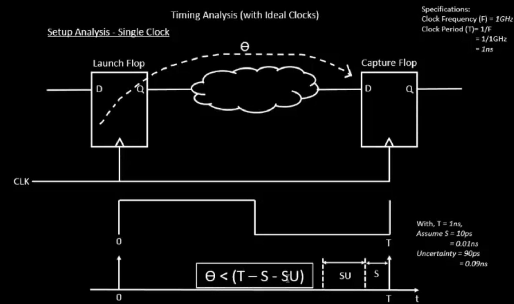
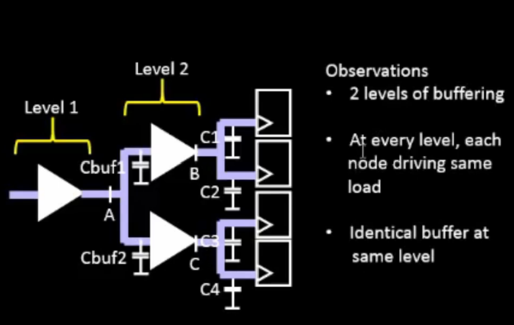
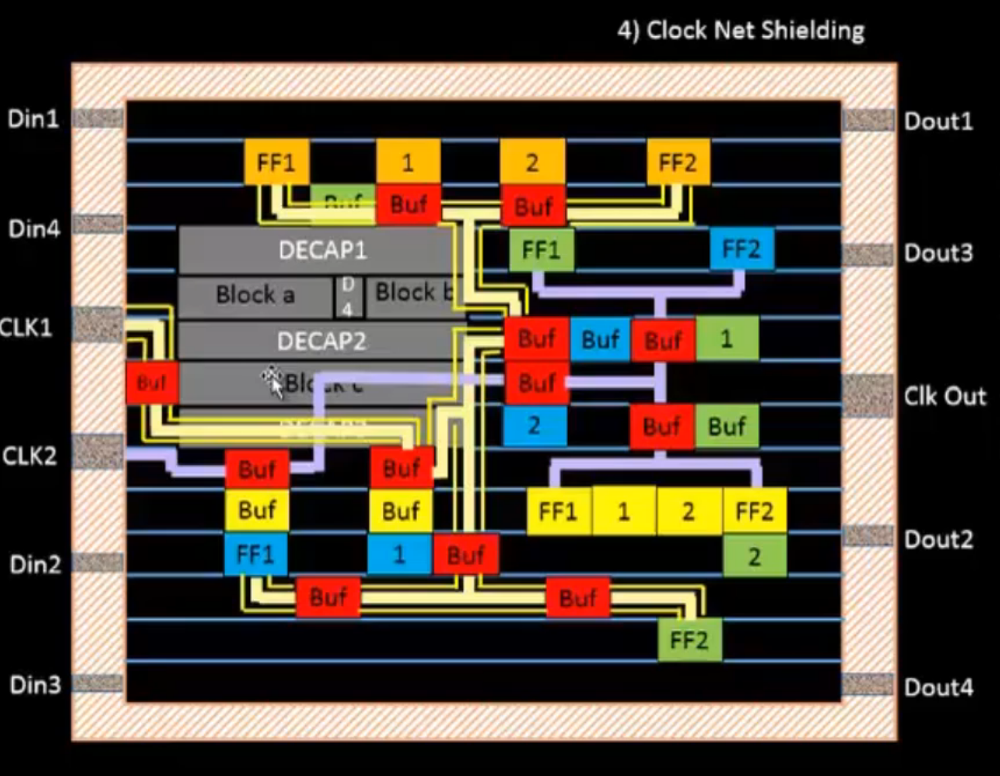
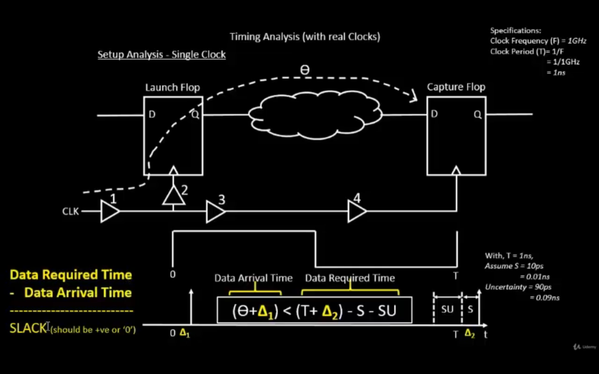
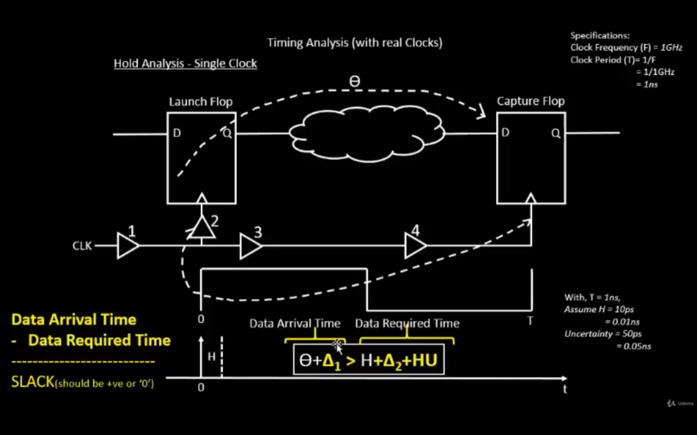

# Day 4 - Pre-Layout Timing Analysis and Importance of Good Clock Tree

## SKY130_D4_SK1 - Timing Modelling using Delay Tables

### L1 - Lab Steps to Convert Grid Info to Track Info

```tcl
# In Magic console — check grid spacing for each layer
# Grid info comes from the tech file (.tech), Track info goes into tracks.info

# Example track.info format:
# layer direction start_offset pitch
li1   X   0.23   0.46
li1   Y   0.17   0.34
met1  X   0.17   0.34
met1  Y   0.17   0.34
```

Tracks define the exact horizontal/vertical grid lines where routing wires are allowed to be placed for each metal layer — required by the router (TritonRoute/FastRoute).

---

### L2 - Lab Steps to Convert Magic Layout to Std Cell LEF

```tcl
# In Magic Tcl console, after opening the custom cell layout

# Step 1: Save the layout's port info — set class and use for each pin
port class input
port use signal

select cell sky130_vsdinv
property LEFclass BLOCK    # or LEFview, define as a hard macro

# Step 2: Write the LEF file
lef write sky130_vsdinv.lef
```

The generated `.lef` contains: cell dimensions, pin locations, pin direction (input/output), and metal layer used for each pin — required so OpenLANE/placer can treat the custom cell like any standard cell.

---

### L3 - Introduction to Timing Libs and Steps to Include New Cell in Synthesis

```bash
# Copy custom cell LEF and lib files into design source
cp sky130_vsdinv.lef ~/.../designs/picorv32a/src/
cp libs/sky130_fd_sc_hd__* ~/.../designs/picorv32a/src/
```

Update `config.tcl`:
```tcl
set ::env(LIB_SYNTH)      "$::env(DESIGN_DIR)/src/sky130_fd_sc_hd__typical.lib"
set ::env(LIB_FASTEST)    "$::env(DESIGN_DIR)/src/sky130_fd_sc_hd__fast.lib"
set ::env(LIB_SLOWEST)    "$::env(DESIGN_DIR)/src/sky130_fd_sc_hd__slow.lib"
set ::env(LIB_TYPICAL)    "$::env(DESIGN_DIR)/src/sky130_fd_sc_hd__typical.lib"
set ::env(EXTRA_LEFS)     [glob $::env(DESIGN_DIR)/src/*.lef]
```

> A `.lib` file describes **timing, power, and function** for every cell — used by the synthesis tool (Yosys/ABC) and timing tool (OpenSTA) to evaluate paths.

---

### L4 - Introduction to Delay Tables

A **delay table** (look-up table, LUT) stores the cell delay as a function of:
- **Input transition time (slew)** — how fast the input signal switches
- **Output load capacitance** — how much capacitance the cell is driving

```
delay = f(input_slew, output_load)
```

This is far more accurate than a single fixed delay number, since real delay changes significantly with fan-out and wire load.

---

### L5 - Delay Table Usage Part 1

Example structure inside a `.lib` file:

```
cell_rise(delay_template_7x7) {
  index_1 ("0.01, 0.05, 0.1, 0.2, 0.4, 0.8, 1.6");   // input slew (ns)
  index_2 ("0.01, 0.05, 0.1, 0.2, 0.4, 0.8, 1.6");   // output load (pF)
  values ( \
    "0.05, 0.07, 0.09, ...", \
    "0.08, 0.10, 0.13, ...", \
    ... \
  );
}
```

To find delay: look up the row matching **input slew** and column matching **output load** — interpolate if the exact value isn't in the table.

---

### L6 - Delay Table Usage Part 2

Same concept applies to:
- `cell_fall` — falling output delay table
- `rise_transition` — output rise slew table
- `fall_transition` — output fall slew table

> The output transition of one stage becomes the input transition of the next stage — this is how delay propagates and accumulates along a timing path.

---

### L7 - Lab Steps to Configure Synthesis Settings to Fix Slack and Include vsdinv

```bash
# Re-run synthesis with custom inverter included
run_synthesis
```

If timing slack is negative (violation), try:
```tcl
set ::env(SYNTH_STRATEGY) "DELAY 0"
set ::env(SYNTH_MAX_FANOUT) 4
set ::env(SYNTH_SIZING) 1
run_synthesis
```

- `SYNTH_STRATEGY "DELAY 0"` → optimizes for delay over area
- `SYNTH_SIZING 1` → allows ABC to upsize cells on critical paths

---

## SKY130_D4_SK2 - Timing Analysis with Ideal Clocks using OpenSTA

### L1 - Setup Timing Analysis and Introduction to Flip-Flop Setup Time

<div align="center">

</div>
<p align="center">
<b>Figure 1:</b> Setup Analysis with Ideal Clock — Launch Flop to Capture Flop
</p>

**Setup time (SU):** minimum time data must be stable **before** the clock edge at the capture flop.

**Setup equation (ideal clock):**
```
θ < (T − S − SU)
```
Where:
- **θ** = combinational logic delay (Launch Flop Q → Capture Flop D)
- **T** = clock period
- **S** = clock-to-Q delay of launch flop (setup margin)
- **SU** = setup time of capture flop

**Worked example:**
```
F = 1 GHz  →  T = 1/F = 1ns
S = 10ps = 0.01ns
Uncertainty = 90ps = 0.09ns

θ < (1ns − 0.01ns − 0.09ns) = 0.9ns
```

> If combinational delay θ exceeds this limit, it's a **setup violation** — data doesn't reach the capture flop in time.

---

### L2 - Introduction to Clock Jitter and Uncertainty

**Clock Jitter:** cycle-to-cycle variation in clock edge timing, caused by noise in the clock generation circuit (PLL).

**Clock Uncertainty:** a margin added during STA to account for:
- Clock jitter
- Clock skew between launch and capture flop
- PLL/OCV (on-chip variation) margins

```tcl
# Setting clock uncertainty in OpenSTA
set_clock_uncertainty 0.09 [get_clocks clk]
```

> Higher uncertainty → less timing margin available → harder to close timing.

---

### L3 - Lab Steps to Configure OpenSTA for Post-Synth Timing Analysis

```tcl
# pre_sta.conf
set_cmd_units -time ns -capacitance pF -current mA -voltage V -resistance kOhm -distance um

read_liberty -max ./src/sky130_fd_sc_hd__slow.lib
read_liberty -min ./src/sky130_fd_sc_hd__fast.lib
read_verilog ./results/synthesis/picorv32a.synthesis.v
link_design picorv32a

read_sdc ./src/my_base.sdc
set_propagated_clock [all_clocks]

report_checks -path_delay min_max \
  -fields {slew trans net cap input_pins} -digits 4
```

```bash
sta pre_sta.conf
```

---

### L4 - Lab Steps to Optimize Synthesis to Reduce Setup Violations

If `report_checks` shows negative slack:

```tcl
set ::env(SYNTH_STRATEGY) "DELAY 0"
set ::env(SYNTH_MAX_FANOUT) 4
run_synthesis

# Re-check timing
sta pre_sta.conf
```

> Lower `SYNTH_MAX_FANOUT` forces synthesis to insert more buffers / use smaller fan-out trees → faster signal propagation → improved setup slack.

---

### L5 - Lab Steps to do Basic Timing ECO

**ECO (Engineering Change Order):** a small, targeted fix to resolve a specific timing violation without re-running the entire flow.

```tcl
# Example: manually upsize a cell on the critical path
# Inside OpenSTA / Verilog netlist edit:

# Replace small inverter with larger drive-strength version
sky130_fd_sc_hd__inv_2  →  sky130_fd_sc_hd__inv_8
```

```bash
# After manual netlist edit, re-run STA only (not full synthesis)
sta pre_sta.conf
```

---

## SKY130_D4_SK3 - Clock Tree Synthesis (TritonCTS) and Signal Integrity

### L1 - Clock Tree Routing and Buffering using H-Tree Algorithm

<div align="center">

</div>
<p align="center">
<b>Figure 2:</b> Clock Tree Buffering — 2 levels, identical buffers per level, each node driving the same load
</p>

**H-Tree algorithm** distributes the clock symmetrically:
- Clock source is split recursively into branches forming an "H" shape
- At each level, the load is **balanced** — every node at the same level drives the same capacitance
- Identical buffers are used at the same level to keep delays matched

**Why this matters:**
- All flip-flops receive the clock at nearly the **same time** → minimizes **clock skew**
- Buffering compensates for IR drop and capacitive loading on long clock nets

```bash
# Run CTS
run_cts
```

---

### L2 - Crosstalk and Clock Net Shielding

<div align="center">

</div>
<p align="center">
<b>Figure 3:</b> Clock Net Shielding — VDD/VSS shield wires routed alongside clock nets
</p>

**Crosstalk:** unwanted coupling between two adjacent signal wires due to parasitic capacitance — a switching neighbor wire can inject noise onto the clock net (which is especially sensitive).

**Clock Net Shielding:** route a grounded (VSS) or VDD wire on both sides of the clock wire.

- Shield wire absorbs coupling capacitance instead of letting it couple to nearby signal wires
- Reduces clock jitter caused by crosstalk from adjacent switching nets
- Increases clock net robustness at the cost of extra routing area

```tcl
# OpenLANE CTS shielding option
set ::env(CTS_CLK_BUFFER_LIST) "sky130_fd_sc_hd__clkbuf_4 sky130_fd_sc_hd__clkbuf_8"
set ::env(CLOCK_NET_ROUTING_RULE) "Clock"
```

---

### L3 - Lab Steps to Run CTS using TritonCTS

```bash
# Run Clock Tree Synthesis
run_cts
```

Output files:
```
designs/picorv32a/runs/<tag>/results/cts/
└── picorv32a.cts.def      ← DEF with clock tree buffers inserted

designs/picorv32a/runs/<tag>/results/synthesis/
└── picorv32a.synthesis_cts.v   ← Netlist with CTS buffers added
```

---

### L4 - Lab Steps to Verify CTS Runs

```bash
# Open OpenROAD to inspect CTS results
openroad

read_lef ./tmp/merged.lef
read_def ./results/cts/picorv32a.cts.def
```

Check:
- Number of clock buffers inserted
- Maximum clock skew across all flops
- Clock tree depth (number of buffer levels)

```tcl
report_clock_skew
```

---

## SKY130_D4_SK4 - Timing Analysis with Real Clocks using OpenSTA

### L1 - Setup Timing Analysis using Real Clocks

<div align="center">

</div>
<p align="center">
<b>Figure 4:</b> Setup Analysis with Real Clocks — clock buffers (1,2,3,4) add delay before reaching flops
</p>

With **real (post-CTS) clocks**, the clock signal passes through actual buffers — each adding delay (**Δ₁** to launch flop, **Δ₂** to capture flop).

**Setup equation (real clock):**
```
(θ + Δ1) < (T + Δ2) − S − SU
```

```
Data Required Time  −  Data Arrival Time  =  SLACK   (must be ≥ 0)
```

**Worked example:**
```
T = 1ns, S = 10ps, Uncertainty = 90ps
(θ + Δ1) < (1 + Δ2) − 0.01 − 0.09
```

> Unlike the ideal clock case, Δ1 and Δ2 are **not equal** — real clock tree buffers introduce skew between launch and capture flop clock arrival times.

---

### L2 - Hold Timing Analysis using Real Clocks

<div align="center">

</div>
<p align="center">
<b>Figure 5:</b> Hold Analysis with Real Clocks — data must not arrive too early at the capture flop
</p>

**Hold time (H):** minimum time data must remain stable **after** the clock edge.

**Hold equation (real clock):**
```
θ + Δ1 > H + Δ2 + HU
```

Where:
- **H** = hold time of capture flop
- **HU** = hold uncertainty

```
Data Arrival Time  −  Data Required Time  =  SLACK   (must be ≥ 0)
```

**Worked example:**
```
H = 10ps = 0.01ns
Uncertainty = 50ps = 0.05ns
θ + Δ1 > 0.01 + Δ2 + 0.05
```

> Hold violations occur when data arrives **too fast** — usually fixed by **adding delay** (buffers), unlike setup violations which need **less delay**.

---

### L3 - Lab Steps to Analyze Timing with Real Clocks using OpenSTA

```tcl
# post_sta.conf
read_lef ./tmp/merged.lef
read_def ./results/cts/picorv32a.cts.def
write_db pico_cts.db

read_db pico_cts.db
read_verilog ./results/synthesis/picorv32a.synthesis_cts.v
read_liberty ./src/sky130_fd_sc_hd__typical.lib
link_design picorv32a

read_sdc ./src/my_base.sdc
set_propagated_clock [all_clocks]

report_checks -path_delay min_max \
  -fields {slew trans net cap input_pins} \
  -format full_clock_expanded -digits 4
```

```bash
openroad post_sta.conf
```

---

### L4 - Lab Steps to Execute OpenSTA with Right Timing Libraries and CTS Assignment

```tcl
# Use correct corner libraries for accurate real-clock analysis
read_liberty -max ./src/sky130_fd_sc_hd__slow.lib    # for setup check
read_liberty -min ./src/sky130_fd_sc_hd__fast.lib    # for hold check

# Ensure CTS-modified netlist (with buffers) is loaded, not pre-CTS netlist
read_verilog ./results/synthesis/picorv32a.synthesis_cts.v
```

> Always use the **CTS netlist** (`*_cts.v`) for post-CTS timing — using the pre-CTS netlist gives misleading ideal-clock results.

---

### L5 - Lab Steps to Observe Impact of Bigger CTS Buffers on Setup and Hold Timing

```tcl
# Change CTS buffer list to use larger drive-strength buffers
set ::env(CTS_CLK_BUFFER_LIST) "sky130_fd_sc_hd__clkbuf_16"
run_cts

# Re-check timing
openroad post_sta.conf
report_checks -path_delay min_max
```

**Observation:**

| Buffer Size | Effect on Setup | Effect on Hold |
|-------------|-----------------|-----------------|
| Smaller buffer | Higher clock delay → may hurt setup slack | Lower delay → may cause hold violations |
| Bigger buffer | Lower delay, drives load faster → improves setup | Higher delay → improves hold margin |

> There's a trade-off: bigger CTS buffers help setup but can fix hold issues too — by adding the needed clock path delay (Δ1/Δ2) — but consume more power and area.

---

## Summary

By the end of Day 4 we understood:
- How to convert a custom Magic layout into a usable LEF and integrate it into OpenLANE synthesis
- How delay tables model cell delay as a function of input slew and output load
- Setup timing analysis with ideal clocks: `θ < (T − S − SU)`
- Clock jitter, uncertainty, and how to configure OpenSTA for post-synthesis timing checks
- How Clock Tree Synthesis (TritonCTS) builds a balanced H-Tree and how shielding protects against crosstalk
- Setup and Hold timing analysis with **real clocks**, including the added clock buffer delays Δ1 and Δ2
- How CTS buffer sizing affects the setup/hold trade-off

---

> Previous: [Day 3 - Design Library Cell using Magic Layout and ngspice Characterization](./Day3-Magic-Layout-ngspice-Characterization.md)

> Next: [Day 5 - Final Steps for RTL2GDS using TritonRoute and OpenSTA](./Day5-RTL2GDS-TritonRoute-OpenSTA.md)
