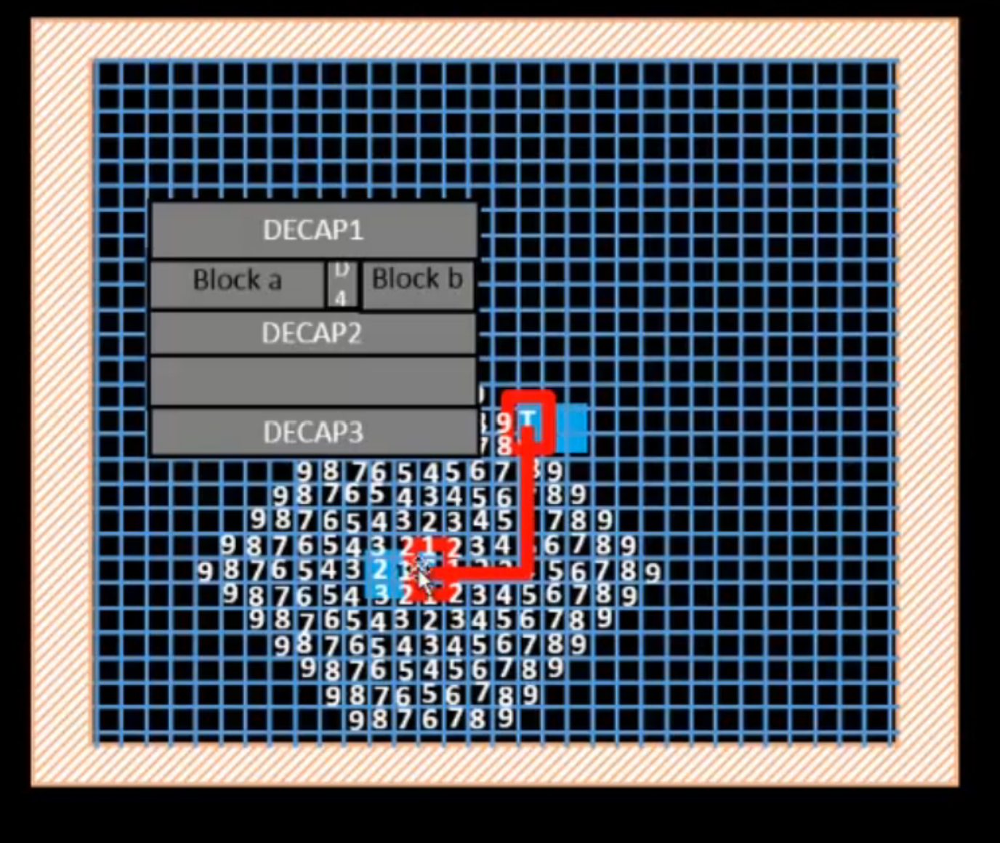
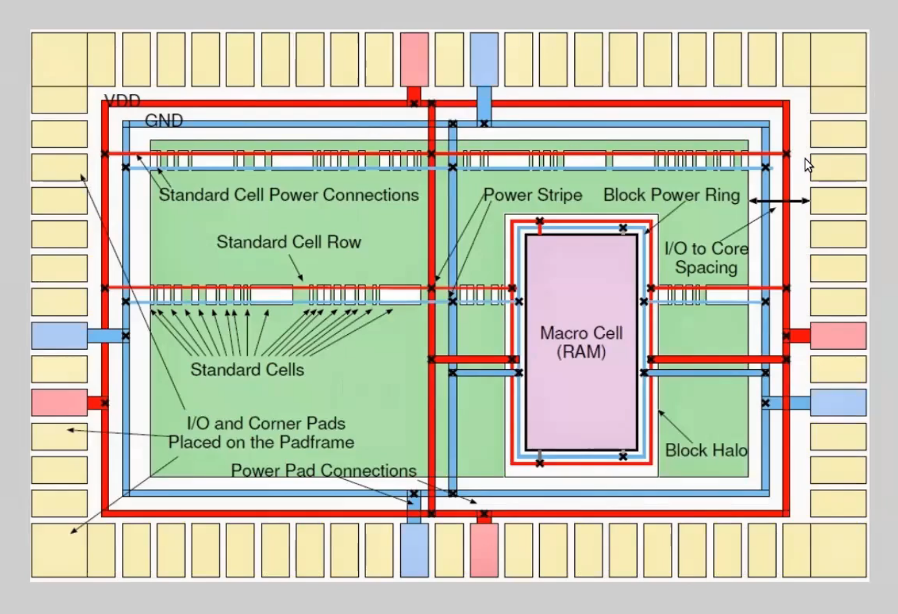
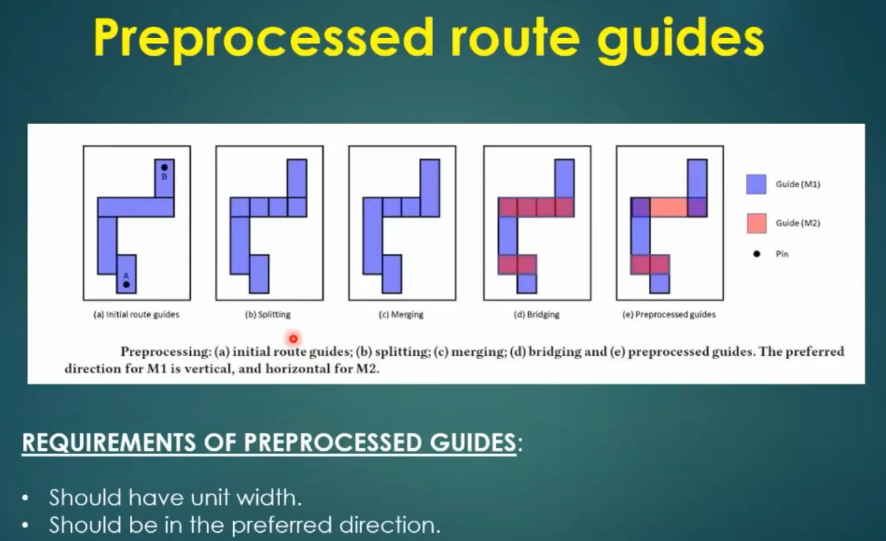
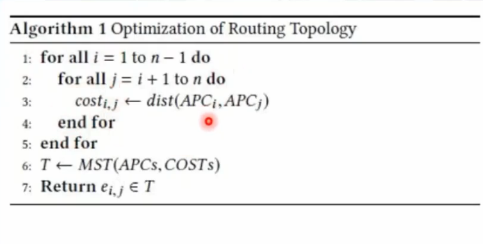

# Day 5 - Final Steps for RTL2GDS using TritonRoute and OpenSTA

## SKY130_D5_SK1 - Routing and Design Rule Check (DRC)

### L1 - Introduction to Maze Routing – Lee's Algorithm

<div align="center">

</div>
<p align="center">
<b>Figure 1:</b> Lee's Algorithm — grid-based breadth-first search to find shortest path between source (T) and target
</p>

**Lee's Algorithm** is a classic **maze routing** technique used to find the shortest connection path between two points on a routing grid, while avoiding obstacles (DECAP cells, blocks).

**How it works (BFS - Breadth First Search):**
1. Mark the **source** cell with value 0
2. Expand outward — every adjacent free cell gets value 1, then 2, then 3, and so on
3. Numbers represent the **distance (in grid steps)** from the source
4. Once the **target** cell is reached, backtrack from target to source following decreasing numbers — this gives the shortest path

> In the figure, numbers radiate outward from the source. The red path shows the final route traced back from the target to the source through decreasing grid values — this guarantees the **shortest possible path**.

---

### L2 - Lee's Algorithm Conclusion

**Advantages:**
- Always finds the shortest path if one exists
- Simple to implement on a grid

**Disadvantages:**
- **Memory intensive** — needs to store distance values for the entire grid
- **Slow** for large designs — explores in all directions equally (not goal-directed)
- Not practical for full-chip routing with millions of nets — used more as a foundational concept

> Modern routers (like TritonRoute) use more advanced, faster algorithms built on similar maze-routing principles but optimized for VLSI-scale designs.

---

### L3 - Design Rule Check (DRC)

**DRC** verifies that the routed layout follows all foundry manufacturing rules:

| Rule Type | Checks |
|-----------|--------|
| **Width** | Minimum width of each metal/poly/diffusion layer |
| **Spacing** | Minimum spacing between two shapes on the same layer |
| **Enclosure** | Minimum overlap required (e.g., via enclosed by metal) |
| **Antenna** | Long isolated metal wires that can accumulate charge during fabrication |

```bash
# Run DRC in Magic after routing
magic -T sky130A.tech
drc check
drc why          # explains each violation
drc count        # total number of violations
```

> Zero DRC violations is mandatory before a design can be sent for fabrication (tape-out).

---

## SKY130_D5_SK2 - Power Distribution Network and Routing

### L1 - Lab Steps to Build Power Distribution Network

<div align="center">

</div>
<p align="center">
<b>Figure 2:</b> Power Distribution Network — VDD/GND rings, power stripes, and standard cell power connections
</p>

The PDN connects power from the **I/O pads** down to every **standard cell** through a hierarchy of structures:

| Element | Description |
|---------|-------------|
| **Power Pad** | I/O pad supplying VDD/GND from outside the chip |
| **Block Power Ring** | VDD/GND ring around the core boundary |
| **Power Stripe** | Vertical/horizontal straps running across the core on upper metal layers |
| **Standard Cell Power Connections** | Horizontal VDD/GND rails embedded in each standard cell row |
| **Block Halo** | Keep-out margin around macro cells (e.g., RAM) for routing clearance |

```bash
# Generate PDN in OpenLANE
gen_pdn
```

```tcl
# Key PDN config variables
set ::env(FP_PDN_VWIDTH)   1.6      ;# Vertical stripe width
set ::env(FP_PDN_HWIDTH)   1.6      ;# Horizontal stripe width
set ::env(FP_PDN_VPITCH)   153.6    ;# Vertical stripe pitch
set ::env(FP_PDN_HPITCH)   153.18   ;# Horizontal stripe pitch
```

---

### L2 - Lab Steps from Power Straps to Std Cell Power

The power flows in this order:

```
Power Pad → Block Power Ring → Power Stripe → Power Rail (per std cell row) → Standard Cell VDD/VSS pins
```

```bash
# View PDN result in Magic
magic -T sky130A.tech \
  lef read ../../tmp/merged.lef \
  def read picorv32a.floorplan.def &
```

In the Magic view, check:
- VDD ring (red) and GND ring (blue) fully enclose the core
- Vertical stripes connect ring to standard cell rows via **via stacks** (marked × in the diagram)
- Every standard cell row has continuous power rail access — no gaps

---

### L3 - Basics of Global and Detail Routing and Configure TritonRoute

**Routing happens in two stages:**

| Stage | Tool | Purpose |
|-------|------|---------|
| **Global Routing** | FastRoute | Decides rough path for each net through coarse grid cells (routing regions), assigns nets to layers |
| **Detailed Routing** | TritonRoute | Converts global route into exact wire geometry on the actual routing grid, respecting all DRC rules |

```bash
# Run full routing (global + detailed) in OpenLANE
run_routing
```

```tcl
# Key routing config variables
set ::env(ROUTING_CORES)            4     ;# Parallel CPU cores for routing
set ::env(GLB_RT_ADJUSTMENT)        0.15  ;# Global routing congestion adjustment
set ::env(DRT_OPT_ITERS)            64    ;# Detailed routing optimization iterations
```

---

## SKY130_D5_SK3 - TritonRoute Features

### L1 - TritonRoute Feature 1 - Honors Pre-Processed Route Guides

<div align="center">

</div>
<p align="center">
<b>Figure 3:</b> Preprocessing route guides — Initial guides → Splitting → Merging → Bridging → Preprocessed guides
</p>

**Route guides** are rough regions (from global routing) within which the detailed router must find the exact wire path.

**Preprocessing steps:**

| Step | Description |
|------|-------------|
| (a) **Initial route guides** | Raw guide shape connecting pin A to pin B |
| (b) **Splitting** | Break the guide into unit-width segments |
| (c) **Merging** | Combine adjacent same-layer segments into clean rectangles |
| (d) **Bridging** | Add guide segments on a different layer (M2) to connect across gaps |
| (e) **Preprocessed guides** | Final clean guide set ready for detailed routing |

**Requirements of preprocessed guides:**
- Should have **unit width**
- Should be in the **preferred direction** (e.g., M1 = vertical, M2 = horizontal)

> TritonRoute strictly stays within these preprocessed guides — it does not deviate outside them, which keeps routing predictable and DRC-clean.

---

### L2 - TritonRoute Feature 2 & 3 - Inter-Guide Connectivity and Intra- & Inter-Layer Routing

**Feature 2 — Inter-guide connectivity:**
- Ensures that when a net's route guide is split into multiple pieces (across layers or due to bridging), all pieces remain electrically connected through vias

**Feature 3 — Intra-layer and inter-layer routing:**
- **Intra-layer routing** — routing within the same metal layer (e.g., M1 to M1)
- **Inter-layer routing** — routing that transitions between layers using vias (e.g., M1 → via → M2)

> Combining both types allows TritonRoute to navigate around obstacles by jumping layers when a direct same-layer path is blocked.

---

### L3 - TritonRoute Method to Handle Connectivity

TritonRoute uses **Access Points (APs)** and **Access Point Clusters (APCs)** on each pin/guide to determine valid connection locations.

- Each pin has multiple possible access points
- TritonRoute selects the best APC combination to connect all required points of a net
- This is what allows flexible connectivity even when guides are split, merged, or bridged across layers

---

### L4 - Routing Topology Algorithm and Final Files List Post-Route

<div align="center">

</div>
<p align="center">
<b>Figure 4:</b> Algorithm 1 — Optimization of Routing Topology using Minimum Spanning Tree (MST)
</p>

**Routing Topology Algorithm:**
```
1. For every pair of Access Point Clusters (APCi, APCj):
     cost[i][j] = distance(APCi, APCj)
2. Build a Minimum Spanning Tree (MST) using all costs
3. Return the tree edges — these define the final routing topology
```

This ensures the **total wirelength** connecting all access points of a net is minimized, using MST as the optimization method.

```bash
# After routing completes
run_routing
```

**Final files generated after routing:**

```
designs/picorv32a/runs/<tag>/results/routing/
├── picorv32a.def              ← Final routed DEF
├── picorv32a.gds               ← (after run_magic) Final GDSII
├── picorv32a.lef
└── picorv32a.spef               ← Extracted parasitics for post-route STA

designs/picorv32a/runs/<tag>/reports/routing/
└── drc.rpt                      ← DRC violation report (should be 0)
```

```bash
# Final sign-off steps
run_parasitics_sta     # post-route STA with extracted SPEF
run_magic               # generate GDSII
run_magic_drc            # final DRC check
run_lvs                  # Layout vs Schematic check
run_antenna_check         # antenna rule check
```

---

## Summary

By the end of Day 5 we understood:
- Maze routing using Lee's Algorithm — a grid-based BFS technique for finding the shortest path
- The role of DRC in verifying manufacturability before tape-out
- The full Power Distribution Network hierarchy: pad → ring → stripe → rail → standard cell
- Global routing (FastRoute) vs Detailed routing (TritonRoute) and how to configure them
- TritonRoute's key features: honoring preprocessed route guides, inter-guide connectivity, intra/inter-layer routing, and access-point based connectivity
- The MST-based routing topology optimization algorithm and the final set of files produced after routing

---

> Previous: [Day 4 - Pre-Layout Timing Analysis and Importance of Good Clock Tree]

This concludes the **5-Day Digital VLSI SoC Design and Planning** workshop — from RTL synthesis to a fully routed, DRC-clean, sign-off ready GDSII layout using completely open-source EDA tools and the Sky130 PDK.
